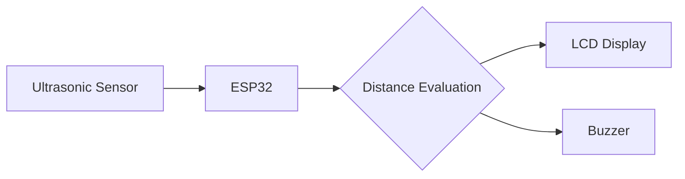

# ADAS Collision Warning System

An ESP32-based collision warning system that uses ultrasonic distance sensing, an LCD display, and an audible buzzer to provide real-time proximity warnings.

## Project Overview

This project demonstrates a basic Advanced Driver Assistance System (ADAS) concept for low-end by monitoring the distance between the vehicle/system and an obstacle. 

The ultrasonic sensor continuously measures obstacle distance, while the ESP32 processes the sensor readings. The system determines whether the obstacle is within the configured warning range. When appropriate, the LCD displays a warning message, and the buzzer provides an audible alert when necessary. 

*Note: This is an embedded-system prototype demonstrating the core concept of collision/proximity warning, not a production automotive ADAS system.*

## Key Features

- Real-time ultrasonic distance measurement
- ESP32-based embedded control
- LCD-based warning message display
- Audible collision/proximity warning using a buzzer
- Continuous obstacle-distance monitoring
- Embedded real-time warning logic

## Hardware Components

| Component | Purpose |
| --- | --- |
| ESP32 | Main microcontroller and system controller |
| Ultrasonic Sensor | Measures distance to nearby obstacles |
| LCD Display | Displays distance/warning information |
| Buzzer | Provides audible warning alerts |

## Software / Technologies

- ESP32
- Embedded C/C++
- `Wire.h` (Built-in I2C library)
- `LiquidCrystal_I2C.h` (Library for the I2C LCD module)
*(Developed and verified using the Arduino IDE)*

## System Architecture



## System Workflow

1. The ultrasonic sensor emits a signal toward the obstacle.
2. The reflected signal is received by the sensor.
3. The ESP32 calculates/reads the corresponding distance.
4. The measured distance is compared against the programmed warning threshold.
5. The LCD displays the current status or warning message.
6. The buzzer activates when the obstacle reaches the configured warning condition.
7. The system continuously repeats this process.

## Warning Logic

The system uses a predefined threshold to determine the state of the vehicle's proximity to an obstacle:
- **Warning Threshold:** `20.0 cm` (Configurable via `WARNING_DISTANCE_CM`)

### Safe Condition (Distance > 20.0 cm)
- LCD displays safe status
- Buzzer OFF

### Warning Condition (Distance ≤ 20.0 cm)
- LCD displays warning
- Buzzer ON

## LCD Output

The LCD provides real-time distance measurements and corresponding status messages:

**Safe:**
```text
Dist: 45.2 cm
Status: SAFE    
```

**Warning:**
```text
Dist: 15.4 cm
WARNING!        
```

**Sensor Error / Out of Range:**
```text
Dist: OUT OF RNG
Status: SAFE    
```

## Buzzer Behavior

The buzzer operates on a continuous feedback loop based on the distance measurement:
- **OFF:** Obstacle is further than the warning threshold (or no echo is received).
- **ON (Continuous):** Obstacle is at or within the warning threshold (≤ 20.0 cm).

## Circuit / Connection Table

| Component | Pin | ESP32 GPIO |
| --- | --- | --- |
| Ultrasonic Sensor | TRIG | GPIO 5 |
| Ultrasonic Sensor | ECHO | GPIO 18 |
| LCD (I2C) | SDA | GPIO 21 |
| LCD (I2C) | SCL | GPIO 22 |
| Buzzer | Signal | GPIO 19 |

## Circuit Diagram

*(
)*

## Project Structure

```text
ADAS-Collision-Warning-System/
├── code/
│   └── ADAS_Collision_Warning.ino
└── README.md
```

## Source Code

The complete ESP32 firmware for this prototype is available inside the `code/` directory.

[View ESP32 Source Code](./code/ADAS_Collision_Warning.ino)

## Required Libraries

- **Wire:** Built-in Arduino library for I2C communication.
- **LiquidCrystal I2C:** Standard library for I2C-based 16x2 or 20x4 LCDs.

## Installation / Setup

### How to use the code

1. **Open the source code:** Navigate to the `code/` directory and open `ADAS_Collision_Warning.ino` in the Arduino IDE.
2. **Install required libraries:** Ensure that you have the `LiquidCrystal I2C` library installed (by Frank de Brabander) along with the built-in `Wire` library.
3. **Select ESP32 board:** Select the appropriate ESP32 board configuration in your IDE.
4. **Connect hardware:** Connect the ESP32, Ultrasonic Sensor (HC-SR04), I2C LCD, and Buzzer according to the exact GPIO definitions in the Circuit / Connection Table above.
5. **Upload:** Compile and upload the firmware to the ESP32.
6. **Run:** Power the system and observe the LCD and buzzer response as an obstacle approaches the sensor.

## How It Works

1. **Initialization:** The ESP32, sensor, LCD, and buzzer are initialized on startup.
2. **Measurement:** The main loop continuously triggers the ultrasonic sensor to measure distance.
3. **Evaluation:** The calculated distance is evaluated against predefined thresholds.
4. **Action:** Based on the evaluation, the LCD is updated with the corresponding status, and the buzzer is triggered if an obstacle is too close.

## Applications

- Vehicle proximity warning prototypes
- Parking assistance concepts
- Obstacle detection systems
- Embedded safety systems
- Driver-assistance demonstrations
- Robotics/vehicle obstacle detection

## Limitations

- Ultrasonic sensing can be affected by surface characteristics and environmental conditions.
- The prototype provides warnings but does not automatically control vehicle braking.
- The system is intended as an educational/embedded prototype rather than a production automotive safety system.

## Future Enhancements

* Future Work: Multiple ultrasonic sensors for wider coverage
* Future Work: Multiple warning zones
* Future Work: Vehicle-speed-aware warning thresholds
* Future Work: CAN bus integration
* Future Work: Automatic emergency braking integration
* Future Work: Camera/radar sensor fusion
* Future Work: Mobile/cloud monitoring
* Future Work: Data logging
* Future Work: More advanced driver-assistance algorithms

## Demonstration / Output

### Normal Condition
The ultrasonic sensor detects sufficient distance. The LCD indicates the safe/normal status, and the buzzer remains inactive.

### Warning Condition
An obstacle enters the configured warning range. The LCD displays the warning message, and the buzzer activates according to the programmed logic.

## Author

**Bhanu Teja**
- GitHub: [https://github.com/2300040449](https://github.com/2300040449)
- LinkedIn: [https://www.linkedin.com/in/bhanutejabheemavaram/](https://www.linkedin.com/in/bhanutejabheemavaram/)
